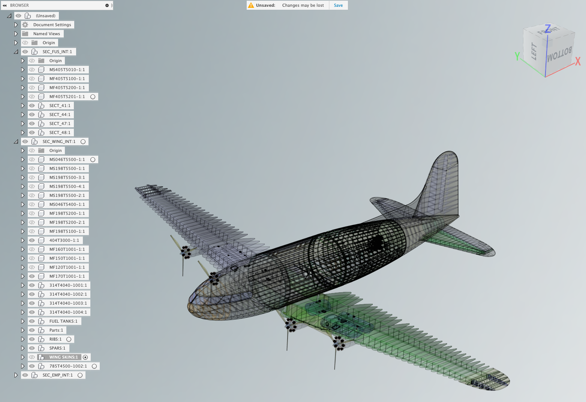

# MBE Demonstrator RM 
Welcome to the Collaboration Repository for the Model Based Enterprise (MBE) Demonstrator Reference Model (RM) activity supporting Aerospace need across the industry standards activity. These models (Native CAD, STEP Models, and other data) are in support of goals for LOTAR and ISO. They also should be considered for other groups: [AFNeT](http://www.afnet.fr/), [PDES, Inc.](http://www.pdesinc.org/), and [prostep ivip](http://www.prostep.org/en/).

We will develop a plan for 2022/2023 enhancements of the MBE Demonstrator RM that will comprise version 1.2.  
The purpose of this product is to demonstrate standards based digital twin and digital thread.  


Using a shell, (or Powershell on Windows), a tree of the current files and folder can be generated using the following commands: 
```
    cd ../MBE-Demonstrator-RM
    tree /f | tee MBD-Demonstrator-RM.txt
```
The output is stored here: [MBD-Demonstrator-RM.txt](https://git.pdes-ch.org/MBE-Demonstrator-RM/MBD-Demonstrator-RM/-/blob/main/MBD-Demonstrator-RM.txt)

Current release is: [MBE Demonstrator RM v1.1](https://github.com/MBE-Demonstrators/MBE-Demonstrator-RM/releases/tag/v1.1)

This file is created in Markdown. Which is a lightweight markup language that you can use to add formatting elements to plain-text text documents. Created by John Gruber in 2004, Markdown is now one of the world’s most popular markup languages.
- [The Markdown Guide](https://www.markdownguide.org/)
- [GitHub Flavored Markdown Spec](https://github.github.com/gfm/)

Contact Timothy Suhr via email at: [timothy.j.suhr@boeing.com](mailto:timothy.j.suhr@boeing.com) or by phone [+1(425)965-6286](tel:1425-965-6286).
